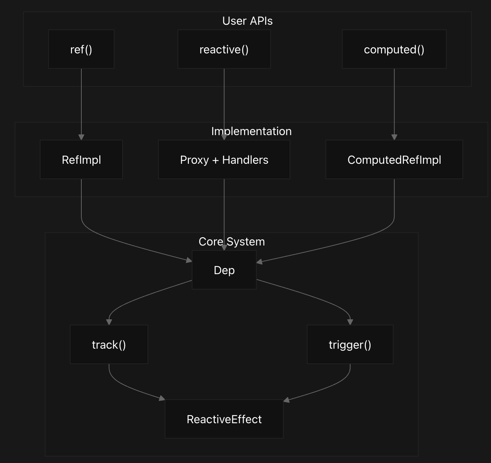

# 第一阶段：基础响应式系统

## 🎯 阶段目标
深入理解Vue 3响应式系统的核心原理，掌握Proxy、依赖收集、派发更新等关键概念。

## 🔍 核心问题

### 问题1：什么是响应式？为什么需要响应式？
**学习重点：**
- 理解响应式编程的概念
- 对比Vue 2和Vue 3的响应式差异
- 理解Proxy相比Object.defineProperty的优势

**实践任务：**
```javascript
// 实现一个最简单的响应式对象
const data = { count: 0 }
const reactiveData = makeReactive(data)

// 当数据变化时，自动执行某些操作
effect(() => {
  console.log('count is:', reactiveData.count)
})

reactiveData.count++ // 应该自动打印新值
```

**答案：**
什么是响应式呢？
响应式编程就是当数据发生变化时，自动触发相关联的更新操作，在vue2中使用Object.defineProperty来实现响应式，而在vue3中使用Proxy来实现响应式。

Object.defineProperty只能监听当前对象属性的变化，对于后续属性的添加和删除操作没办法做到响应式，并且对于数组指定下标元素进行更新的话也无法触发更新，需要通过Vue.set() or this.$set()来进行响应式设置，而Proxy可以监听整个对象的变化，包括属性的添加、删除等操作。


### 问题2：Proxy是如何拦截对象操作的？
**学习重点：**
- Proxy的基本用法和所有拦截器
- get、set、has、deleteProperty等拦截器的作用
- Reflect的作用和为什么要配合使用

**实践任务：**
```javascript
// 实现一个能拦截所有操作的Proxy
const obj = { name: 'Vue', version: 3 }
const proxied = new Proxy(obj, {
  get(target, key, receiver) {
    console.log(`读取属性: ${key}`)
    // 思考：为什么要用Reflect.get而不是target[key]？
    /**
     * this指向问题：
     * 在Proxy的get/set拦截器中，this指向的是原始对象，而不是代理对象。
     * 使用Reflect.get可以确保this指向正确的代理对象
     * 这样可以确保在访问属性时，能够正确地获取到代理对象的
     */
  },
  set(target, key, value, receiver) {
    console.log(`设置属性: ${key} = ${value}`)
    // 思考：如何判断是新增属性还是修改属性？
    // 貌似不需要判断，Proxy会自动处理
    return Reflect.set(target, key, value, receiver)
  }
  // ... 其他拦截器
})
```
**答案：**

为什么Proxy需要配合Reflect？

Reflect是一个内置对象，它提供了拦截器的默认行为方法，比如get、set等。使用Reflect可以确保我们在拦截器中调用原始操作时，能够正确处理继承链和原型链上的属性访问。


### 问题3：依赖收集是如何工作的？
**学习重点：**
- 什么是依赖收集？
- effect函数的作用和实现原理
- track函数如何收集dependencies
- 依赖收集的数据结构设计

**实践任务：**
```javascript
// 实现依赖收集系统
let activeEffect = null
const targetMap = new WeakMap()

function effect(fn) {
  activeEffect = fn
  fn() // 执行函数，触发get拦截器，进行依赖收集
  activeEffect = null
}

function track(target, key) {
  // 思考：如何建立target -> key -> effects的映射关系？
  /**
   *  targetMap是一个WeakMap，key是target对象，value是一个Map，
   *  Map的key是属性名，value是一个Set，存储所有依赖于这个属性的effect函数。
   *  这样可以确保每个target和key的组合只存储一次effect函数，避免重复执行。
   *  WeakMap的优势是可以自动清理不再使用的target对象，避免内存泄漏。
   * /
  // 思考：为什么使用WeakMap而不是Map？
}
```
**答案：**
依赖收集的核心是在访问响应式对象的属性时，自动记录哪些副作用函数（effect）依赖于这个属性。当属性值变化时，这些副作用函数会被重新执行。

effect函数的作用就是注册一个副作用函数，并在执行时收集依赖

track函数则负责将当前的activeEffect（正在执行的副作用函数）添加到targetMap中对应的target和key下。

大致流程就是当effect函数执行时，将activeEffect设置为当前执行的effect函数，触发响应式数据的get拦截器，执行里面的track函数，将activeEffect添加到targetMap中对应的target和key下。


### 问题4：派发更新是如何触发的？
**学习重点：**
- trigger函数的实现原理
- 数组操作的特殊处理

**实践任务：**
```javascript
function trigger(target, key, type) {
  // 思考：如何找到需要执行的effects？
  /**
   *  targetMap存储了所有响应式对象的依赖关系，
   * /
  // 思考：数组的length变化如何处理？
  /**
   * 判断属性是否是Array，记录原来数组的长度，修改后判断长度是否变化，如果变化手动添加一个length属性的更新
   * 这样可以确保数组的length变化时，能够正确触发依赖收
   * /
  // 思考：如何避免重复执行同一个effect？
  /**
   * 使用Set的数据结构来存储effects，确保每个effect只执行一次。
   * 这样可以避免在同一个trigger调用中重复执行同一个effect。
   */
}

// 测试用例
const arr = reactive([1, 2, 3])
effect(() => {
  console.log('数组长度:', arr.length)
})
arr.push(4) // 应该触发effect
```
**答案：**

trigger函数的作用是当响应式数据发生变化时，通知所有依赖于这个数据的副作用函数重新执行。
在Proxy的set拦截器中，当数据被修改时，会调用trigger函数，数组的操作都会执行Proxy中的set拦截器，从而触发依赖收集和派发更新，需要特殊处理的是length属性的变化。

### 问题5：ref是如何实现的？为什么需要ref？
**学习重点：**
- ref的设计理念和使用场景
- ref和reactive的区别
- .value的实现原理

**实践任务：**
```javascript
// 实现ref
function ref(value) {
  // 思考：为什么基本类型需要包装成对象？
  /**
   * 基本类型（如number、string等）在JavaScript中是不可变的，
   * 需要通过对象包装才能实现响应式。
   * 这样可以确保当基本类型的值变化时，能够触发依赖收集和更新。
   */
  // 思考：如何实现.value的响应式？
  /**
   * ref返回一个对象，这个对象有一个value属性，
   * 当访问.value时，会触发get拦截器，进行依赖收集。
   * 当设置.value时，会触发set拦截器，进行派发更新。
   */
}

const count = ref(0)
effect(() => {
  console.log('count:', count.value)
})
count.value++ // 应该触发effect
```
**答案：**

ref的作用是将基本类型（如number、string等）包装成一个响应式对象，使其能够参与Vue的响应式系统。

ref函数返回一个对象，这个对象有一个value属性，当访问.value时，会触发get拦截器，进行依赖收集。当设置.value时，会触发set拦截器，进行派发更新。


### 问题6：computed是如何实现懒计算和缓存的？
**学习重点：**
- computed的缓存机制
- 懒计算的实现原理
- computed和effect的关系

**实践任务：**
```javascript
// 实现computed
function computed(getter) {
  // 思考：如何实现缓存？
  // 思考：何时重新计算？
  // 思考：computed本身也是响应式的，如何实现？
}

const state = reactive({ firstName: 'John', lastName: 'Doe' })
const fullName = computed(() => {
  console.log('计算fullName') // 应该只在依赖变化时执行
  return `${state.firstName} ${state.lastName}`
})
```

## 📖 理论学习资源

### Vue 3官方文档
- [响应式基础](https://cn.vuejs.org/guide/essentials/reactivity-fundamentals.html)
- [深入响应式系统](https://cn.vuejs.org/guide/extras/reactivity-in-depth.html)

### 推荐阅读源码位置
```
vue-next/packages/reactivity/src/
├── reactive.ts          # reactive实现
├── ref.ts              # ref实现
├── effect.ts           # effect和依赖收集
├── computed.ts         # computed实现
└── baseHandlers.ts     # Proxy拦截器
```

### 关键概念梳理
1. **响应式对象** - 通过Proxy创建的能够自动追踪变化的对象
2. **副作用函数** - 会产生副作用的函数，需要在数据变化时重新执行
3. **依赖收集** - 在副作用函数执行时收集其依赖的响应式数据
4. **派发更新** - 当响应式数据变化时，通知所有依赖它的副作用函数重新执行

## 🛠️ 实践任务清单

- [ ] 实现基础的reactive函数
- [ ] 实现effect函数和依赖收集
- [ ] 实现trigger函数和派发更新
- [ ] 处理数组的响应式
- [ ] 实现ref函数
- [ ] 实现computed函数
- [ ] 处理边界情况（循环依赖、嵌套effect等）
- [ ] 编写测试用例验证实现正确性

## 🔬 源码研读重点

### 1. reactive.ts中的createReactiveObject函数
```typescript
// 思考问题：
// 1. 为什么需要不同的拦截器？
// 2. 如何处理已经是响应式的对象？
// 3. 如何处理不可代理的对象？
```

### 2. effect.ts中的ReactiveEffect类
```typescript
// 思考问题：
// 1. 为什么需要effect栈？
// 2. 如何处理effect的停止和恢复？
// 3. scheduler的作用是什么？
```

### 3. baseHandlers.ts中的get和set拦截器
```typescript
// 思考问题：
// 1. 如何处理深层嵌套的对象？
// 2. 如何处理数组的特殊索引？
// 3. 如何避免不必要的依赖收集？
```

## ✅ 学习成果检验

完成本阶段学习后，您应该能够：

1. **理论理解**
   - [ ] 清楚解释什么是响应式以及Vue 3响应式的优势
   - [ ] 理解Proxy相比Object.defineProperty的优势
   - [ ] 掌握依赖收集和派发更新的完整流程

2. **实践能力**
   - [ ] 独立实现一个基础的响应式系统
   - [ ] 处理各种边界情况和异常场景
   - [ ] 编写完整的测试用例

3. **源码理解**
   - [ ] 能够阅读Vue 3响应式相关源码
   - [ ] 理解源码中的设计思路和实现细节
   - [ ] 能够解释源码中的关键函数作用

## 🎯 进阶思考题

1. 为什么Vue 3选择Proxy而不是继续使用Object.defineProperty？
2. 依赖收集的数据结构为什么设计成target -> key -> effects的映射？
3. effect嵌套时如何正确收集依赖？
4. 如何处理Set、Map等集合类型的响应式？
5. computed的懒计算是如何实现的？什么时候会重新计算？

## 📝 学习笔记模板

```markdown
## 今日学习内容
- 学习的问题：
- 理解的概念：
- 实现的代码：
- 遇到的困难：
- 解决的方法：

## 思考与总结
- 新的理解：
- 疑问点：
- 下次学习计划：
```

完成本阶段学习后，请进入[第二阶段：编译器系统](./第二阶段-编译器系统.md)！
